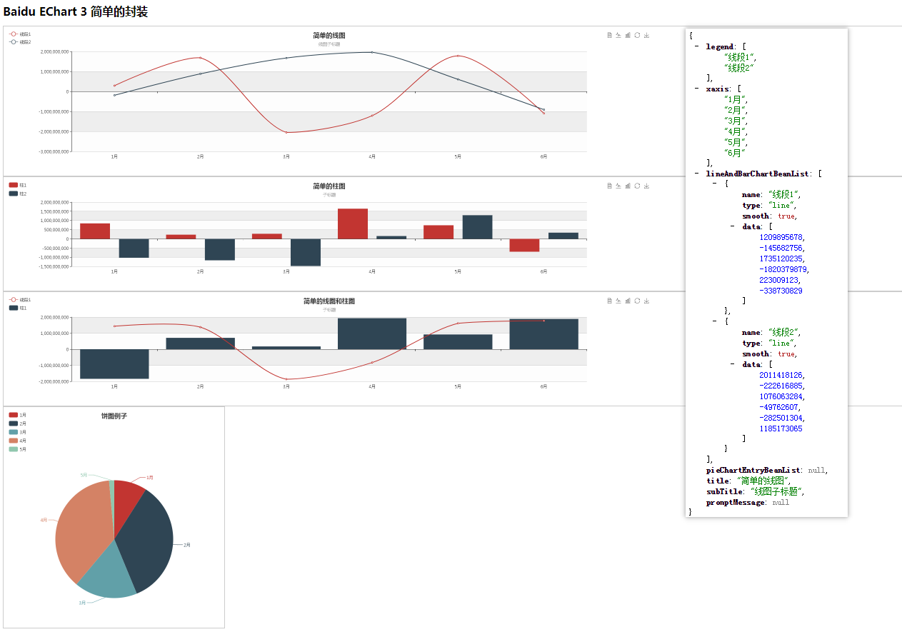

# springboot-study

## springboot-chart
柱状图、条形图、饼图数据的简单封装。在做一些报表统计时如果涉及到图表，可以参考这个 demo。

参考 [xwjie](https://github.com/xwjie/SpringBootEChart) 的开源代码，修改了一部分，方便以后用到项目中去。

效果图


## springboot-cors

Spring Boot 结合 CORS 在服务端解决 AJAX 跨域问题的 demo。

1.使用 <code>CorsConfiguration</code> 配置
```java
@Configuration
public class CorsConfig {
    private static final String ORIGIN = "Origin";
    private static final String HEADERS = "Access-Control-Request-Headers";
    
    /**
     * 通过设置自定义 CorsFilter 过滤器支持跨域
     *
     * @return
     */
    @Bean
    public MyCorsFilter injectCorsFilter() {
        return new MyCorsFilter();
    }

    private CorsConfiguration buildConfig() {
        CorsConfiguration corsConfiguration = new CorsConfiguration();

        corsConfiguration.addAllowedOrigin("*");
        // 设置支持带 Cookie 的跨域请求
        corsConfiguration.setAllowCredentials(true);
        corsConfiguration.addAllowedHeader("*");
        corsConfiguration.addAllowedMethod("*"); 
        // 设置非简单请求的预检命令缓存时间，单位 's'
        corsConfiguration.setMaxAge(1728000L);
        
        return corsConfiguration;
    }
}
```
2.使用过滤器配置
```java
public class MyCorsFilter extends OncePerRequestFilter {
    private static final String ORIGIN = "Origin";
    private static final String HEADERS = "Access-Control-Request-Headers";
    
    @Override
    protected void doFilterInternal(HttpServletRequest request, HttpServletResponse response, FilterChain filterChain) 
            throws ServletException, IOException {
        // 获取请求头中的 'Origin' 信息
        String origin = request.getHeader(ORIGIN);
        // 获取请求头中的 'header' 信息
        String headers = request.getHeader(HEADERS);
        
        /**
         * 1.支持任何域名跨域访问
         * 当 'Access-Control-Allow-Origin' 设置为 '*' 时，不能解决带 Cookie 的跨域
         */
        if (!StringUtils.isEmpty(origin)) {
            response.setHeader("Access-Control-Allow-Origin", origin);
        }

        /**
         * 2.支持自定义请求头的跨域
         */
        if (!StringUtils.isEmpty(headers)) {
            response.setHeader("Access-Control-Allow-Headers", headers);
        }
        
        // 3.设置支持带 Cookie 的跨域请求
        response.setHeader("Access-Control-Allow-Credentials", "true");
        // 4.设置允许跨域请求的方法形式 'GET'、'DELETE' 等
        response.setHeader("Access-Control-Allow-Methods", "*");
        // 5.设置非简单请求的预检命令缓存时间，单位 's'
        response.setHeader("Access-Control-Max-Age", "1728000");

        if ("OPTIONS".equals(request.getMethod())) {
            response.setStatus(HttpServletResponse.SC_OK);
        } else {
            filterChain.doFilter(request, response);
        }
            
    }
}
```
## springboot-error

Spring Boot 可以根据 HTTP 的请求头（<code>accept</code>）信息，判断客户端想要什么类型的返回数据（HTML OR JSON），可以在 <code>BasicErrorController</code> 类中查看。

在有模板引擎的情况下，Spring Boot 底层会扫描 <code>templates/error/×××.html</code> 页面，根据 HTTP 的响应码找到对应的错误提示页面，在该页面下也可以通过表达式获取一些错误提示信息。

如果没有配置模板引擎，则扫描 <code>static/error/×××.html</code> 页面。

这个 demo 对异常与错误进行了整合，当出现异常与 404 错误时，用浏览器访问会跳转到 <code>templates/error/404.html</code> 页面，其他客户端访问时会返回内置与自定义的 JSON 数据。

统一异常处理类
```java
@ControllerAdvice
public class GlobalExceptionHandler {
    
    @ExceptionHandler(RuntimeException.class)
    public String handlexception(Exception e, HttpServletRequest request) {
        Map<String, Object> map = new HashMap<>(16);
        
        map.put("code", 0);
        map.put("message", "出异常啦");
        
        // 设置异常处理的状态码为 404
        request.setAttribute("javax.servlet.error.status_code", 404);
        // 将错误信息封装成 map 保存在转发域中
        request.setAttribute("myErrorInfo", map);
        
        // 出现异常时转发到 'error' 请求，跳转到 404 页面
        return "forward:/error";
    }
}
```
自定义 Error Attributes 方案
```java
@Component
public class GlobalErrorAttributes extends DefaultErrorAttributes{

    @Override
    public Map<String, Object> getErrorAttributes(WebRequest webRequest, boolean includeStackTrace) {
        Map<String, Object> map = super.getErrorAttributes(webRequest, includeStackTrace);
        // 获取异常处理中的错误信息，'0' 表示从转发域中获取
        Map<String, Object> myErrorMap = (Map<String, Object>) webRequest.getAttribute("myErrorInfo", 0);
        
        // 模板页面，JSON 都可以获取
        map.put("test", "测试信息");
        // 模板页面不能获取，JSON 可以
        map.put("myErrorInfo", myErrorMap);
        
        return map;
    }
}
```
现在开发基本都是前后端分离的，后端只负责返回 JSON 数据。关于前后端分离异常信息的处理，可以参考 springboot-mybaits-plus 中的代码。

## springboot-jsp

Spring Boot 整合 JSP 开发的 demo，基于 Spring Boot2.0 以上版本，使用本地 tomcat 容器。需要注意的是，本地 tomcat 容器版本必须支持 Spring Boot 的版本，否则启动 tomcat 时会报错。 在新建项目的时候注意选择 war 包。

demo 基于 Spring Boot 2.03、Tomcat-8.5.31。

pom 文件
```xml
<!-- 嵌入式的 tomcat 设置成  provided-->
<dependency>
	<groupId>org.springframework.boot</groupId>
	<artifactId>spring-boot-starter-tomcat</artifactId>
	<scope>provided</scope>
</dependency>
```
## springboot-jxls

Spring Boot 整合 jxls 实现 Excel 文档的导出与下载。

Excel 文件导出
```java
    /**
     *  导出 Excel
     * 
     * @param source 模板文件路径
     * @param target 目标文件（文件下载时的路径）
     * @param beansMaps
     * @return 下载文件路径
     * @throws Exception
     */
    public static String export(String source, String target, Map<String, Object> beansMaps) throws Exception {
        String[] sourceArrays = source.split("\\.");
        source = TEMPLATE_PATH + File.separator + source;
        target = SAVE_PATH + File.separator + sourceArrays[0] + "-" + System.currentTimeMillis() + "." + sourceArrays[1];
        File file = new File(SAVE_PATH);
        
        if (!file.exists()) {
            file.mkdir();
        }
                
        XLSTransformer transformer = new XLSTransformer();
        
        transformer.transformXLS(source, beansMaps, target);
        
        return target;
    }
```
Excel 文件下载
```java
public ResponseEntity<byte[]> down(String trueName, String downLoadPath) throws Exception {
        File file = new File(downLoadPath);
        HttpHeaders headers = new HttpHeaders();
        String fileName;
        
        try {
            String userAgent = request.getHeader("User-Agent");
            
            // 判断是否为IE
            if (userAgent.toUpperCase().indexOf("MSIE") > 0 || userAgent.toUpperCase().indexOf("TRIDENT") > 0) {
                fileName = URLEncoder.encode(trueName, "UTF-8");
            } else {
                fileName = new String(trueName.getBytes("UTF-8"), "iso-8859-1");
            }
        } catch (UnsupportedEncodingException e) {
            throw new Exception("文件名转码失败", e);
        } 
        
        // 解决中文名称乱码问题
        headers.setContentDispositionFormData("attachment", fileName);
        headers.setContentType(MediaType.APPLICATION_OCTET_STREAM);
        
        byte[] bytes;
        
        try {
            bytes = FileUtils.readFileToByteArray(file);
        } catch (IOException e) {
            throw new Exception("读取文件失败", e);
        }
        
        return new ResponseEntity<>(bytes, headers, HttpStatus.OK);
    }
```
## springboot-mail

Spring Boot 整合邮件开发，定时任务。

使用定时任务发送邮件 >_< ~
```java
@Component
public class MailTask {
    
    @Autowired
    private JavaMailSenderImpl mailSender;

    /**
     * second, minute, hour, day, month, week
     * 特殊字符语法:, 枚举, - 区间, * 任意, / 步长, ? 日与星期冲突匹配, L 最后, W 工作日
     * 
     * @throws Exception
     */
    @Scheduled(cron = "0/10 * * * * MON-FRI")
    public void test() throws Exception{
        MimeMessage mimeMessage = mailSender.createMimeMessage();
        MimeMessageHelper mimeMessageHelper = new MimeMessageHelper(mimeMessage, true);

        mimeMessageHelper.setSubject("测试测试测测测");
        mimeMessageHelper.setText("<b style='color:red'>测试测试</b>", true);

        mimeMessageHelper.setTo("1012037464@qq.com");
        mimeMessageHelper.setFrom("×××@foxmail.com");

        mimeMessageHelper.addAttachment("1.jpg",
                ResourceUtils.getFile(ResourceUtils.CLASSPATH_URL_PREFIX + "static/images/1.jpg"));

        mailSender.send(mimeMessage);
    }
}
```
## springboot-mybatis

整合了基于注解与配置文件两种方式的 demo，使用阿里开源的数据源 <code>druid</code>，并配置了监控中心。

基于 xml 形式配置数据源
```java
@Configuration
public class DataSourceConfiguration {

    /**
     * 根据配置文件注入数据源属性
     * 比如：用户名，密码，初始化数值，类型等
     * 
     * @return
     */
    @ConfigurationProperties(prefix = "spring.datasource")
    @Bean
    public DataSource druidDataSource() {
        return new DruidDataSource();
    }

    /**
     * 设置 Druid 监控的 Servlet
     * 
     * @return
     */
    @Bean
    public ServletRegistrationBean statViewServlet() {
        ServletRegistrationBean registrationBean = new ServletRegistrationBean(new StatViewServlet(), "/druid/*");
        Map<String, String> initParams = new HashMap<>(16);
        initParams.put("allow", "");
        initParams.put("loginUsername", "admin");
        initParams.put("loginPassword", "123456");
        registrationBean.setInitParameters(initParams);
        return  registrationBean;
    }

    /**
     * 注册 Druid 监控的 Filter
     * 
     * @return
     */
    @Bean
    public FilterRegistrationBean webStatFilter() {
        FilterRegistrationBean registrationBean = new FilterRegistrationBean(new WebStatFilter());
        Map<String, String> initParams = new HashMap<>(16);
        initParams.put("exclusions", "*.js,*.gif,*.jpg,*.png,*.css,*.ico,/druid2/*");
        registrationBean.setInitParameters(initParams);
        registrationBean.setUrlPatterns(Arrays.asList("/*"));
        return registrationBean;
    }
    
}
```
yuml 配置文件
```yuml
spring:
  datasource:
    username: root
    password: 1234
    url: jdbc:mysql://localhost:3306/ssm_crud
    driver-class-name: com.mysql.jdbc.Driver
    type: com.alibaba.druid.pool.DruidDataSource
    initialSize: 5
    minIdle: 10
    maxActive: 20
    maxWait: 60000
    timeBetweenEvictionRunsMillis: 60000
    minEvictableIdleTimeMillis: 300000
    testWhileIdle: true
    testOnBorrow: false
    testOnReturn: false
    filters: stat,wall
    poolPreparedStatements: false
    maxPoolPreparedStatementPerConnectionSize: 20

mybatis:
  config-location: classpath:mybatis/mybatis-config.xml
  mapper-locations: classpath:mybatis/sql-mapper/*.xml

# 在控制台输出 SQL 语句  
logging:
  level:
    com.jas.mapper: debug
```
## springboot

实现了 SpringBoot + MyBatis 搭建的小程序。<code>areadisplay </code> 中包含了小程序所需要的代码，<code>t_area.sql </code> 是数据库导出的结构文件，<code>src </code> 目录下为主要的后端代码。


## springboot-swagger

Spring Boot 整合 Swagger API 构建工具，提供可视化的 UI 文档界面，便于前后端交互。

Swagger 配置类
```java
@Configuration
@EnableSwagger2
public class SwaggerConfiguration {
    @Bean
    public Docket createRestApi() {
        return new Docket(DocumentationType.SWAGGER_2)
                .apiInfo(apiInfo())
                .select()
                .apis(RequestHandlerSelectors.basePackage("com.jas"))
                .paths(PathSelectors.any())
                .build();
    }

    private ApiInfo apiInfo() {
        return new ApiInfoBuilder()
                .title("swagger构建api文档")
                .description("swaggerTest")
                .termsOfServiceUrl("https://blog.csdn.net/codejas/")
                .version("1.0")
                .build();
    }
}
```
## springboot-mybatis-plus 

Spring Boot 整合 MyBatis Plus 的企业级 demo。

采用前后端分离的方式，在后端使用通用的实体返回 JSON 数据，包括枚举的使用、统一分页请求与响应实体类、自定义异常与异常处理等。
